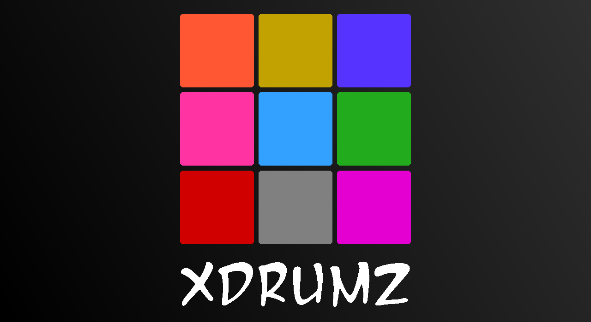

# xDrumz
xDrumz is a 3x3 Drum Application

## Table of Contents

- [Features](#features)
- [Getting Started](#getting-started)
- [Usage](#usage)
- [License](#license)

## Features

- **Intuitive Drum Kit:** A user-friendly drum kit interface for an authentic drumming experience.
- **Play Along:** Play along with pre-set rhythms or create your own unique beats.

## Getting Started

1. **Installation:**
   - There is a build included in the builds folder that can be installed on compatible android devices
2. **Build from source**
   - Clone the repository then execute "npm install" to install all the dependencies

## Usage
1. **Open the App:**
   - Launch the Drumming App on your mobile device.

2. **Play Along:**
   - Choose a pre-set rhythm or create your own beats.
   - Use headphones for an immersive experience.

## License
This project is licensed under the [MIT License] - see the [LICENSE.md](LICENSE.md) file for details.
